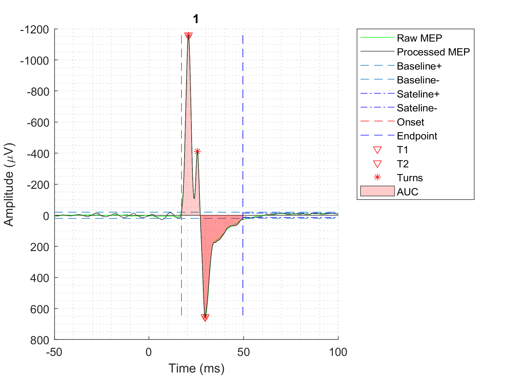
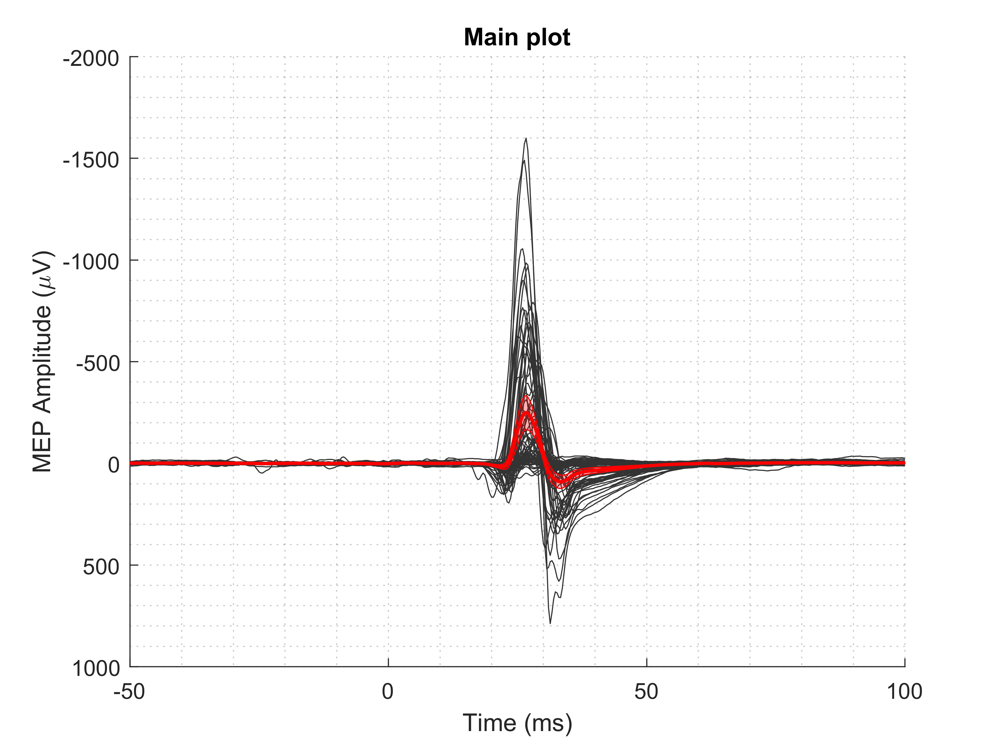
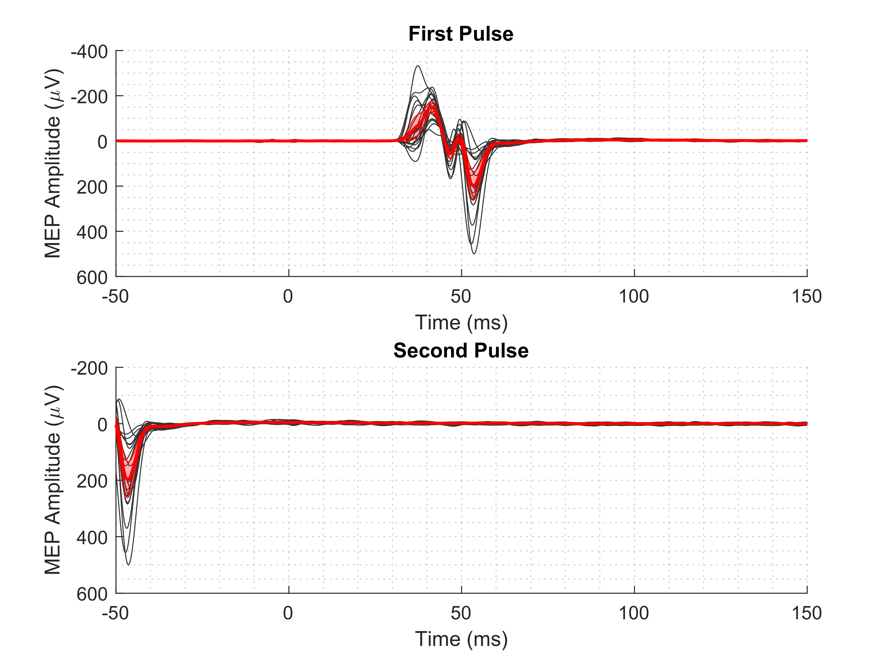
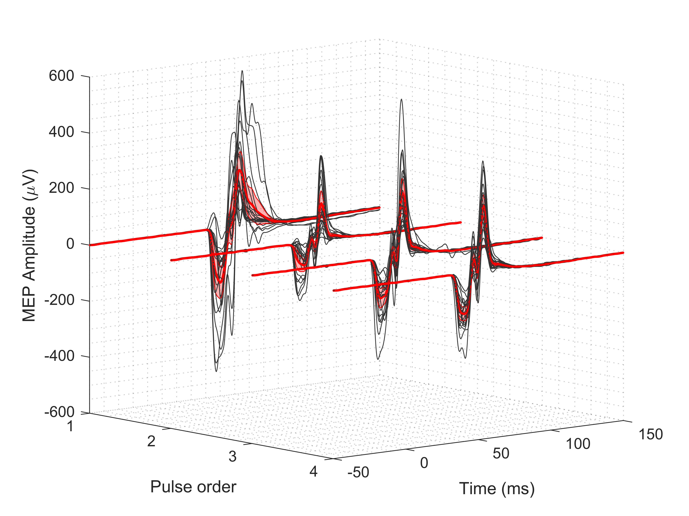
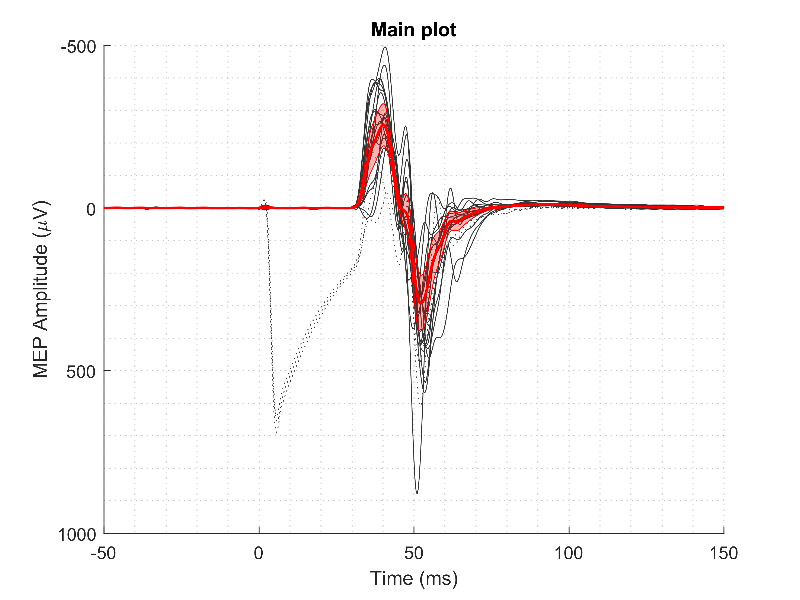

# MEPFeatX

Automated Feature Extraction for Motor-evoked potential (MEP) in Transcranial Magnetic Stimulation (TMS). The package was tested on MEPs recorded in seven different stimulation paradigms; sample datasets and primed templates for feature extraction were also provided. This package aids the research work related to MEP by automatically extracting important MEP features, allowing its users to evaluate the responses reliably, and reproduce the pipeline for their own use.


## Deployment

The workflow for MEP feature extraction are suggested in the *main.m* script. To deploy this package, first edit *dir_root* variable in *main.m* to the current location of the package.

```bash
  dir_root = 'D:\MEPanalyzer\';
```
Then run the script *main.m*
```bash
  main.m
```

The script will first create a configuration file for the deployment, and verify the output of the package in the new system (*verify_functionality.m*).

The main script provides the template to perform feature extraction on one dataset, or all dataset in the *data/* folder. The extracted features are then saved to *analysis_xxxxxx/* folder. Any MEP dataset can be inputted to *extract_features.m*. For higher level of visualization, four use cases of MEPFeatX are included in the *use_cases/* folder that the user can utilize.

The features and figures are saved to the *analysis_xxxxxx/* folder. Logs of each extraction run are saved to the *logs/* folder.

The *create_feature_table.m* script will combine these features file with metadata table provided along with the package, and create a table that the user can use for further analysis. For example, *plot_feature_boxplots.m* script will visualize the boxplots of each feature based on predefined categories.
## Use cases
```MATLAB
extract_features_[protocol](config, file_name)
```
*extract_features.m* and *extract_features_[protocol].m* functions extract MEP features from the input dataset. It first visualizes the whole dataset, and then extracts features, visualizes and saves figures to the *analysis_xxxxxx* folder.

* Notes:
  * This function create new directories to save outputs based on the file_name. 
  * MEP dataset should have rows as samples, and column as a stack of trials.
  * The length of time *t* must be equal to the number of samples in response. If not, either re-config *t* in get_threshold_value.m*, or prepare MEP dataset to desired length.

* Inputs:
  * config:     config file for controlling the feature extraction
  * file_name:  MEP dataset either in MAT-file or ASCII file.

* Output: All outputs of this function are saved to the *analysis_xxxxxx* folder.
  * features:   saved in MAT-files under the *features/* subfolder, and
  * figures:    saved in .png under *figures/[file_name]* subfolders

### Feature extraction for single-pulse sequences

```MATLAB
extract_features_singlePulse(config, file_name)
```



### Feature extraction for LICI sequences

```MATLAB
extract_features_LICI(config, file_name)
```

extract_features_LICI.m is the modified script of extract_features.m for long-interval cortical inhibition (LICI) sequences. This sample dataset contains 20 bursts, each has two pulses. The script first groups and visualizes the first pulses and the second pulses, then extracts and visualizes features.
 
* Notes:  Pulse order and pulse group should be edited according to the LICI protocol if different.

### Feature extraction for RS sequences
```MATLAB
extract_features_RS(config, file_name)
```


extract_features_RS is the modified extract_features.m for repetition supression (RS) sequences. The sample dataset contains 20 bursts, each has four pulses at 120% rMT delivered 1 s apart.  The script first groups and visualizes the first pulses and the second pulses, then extracts and visualizes features.

* Notes:
  * Pulse order and pulse group should be edited according to the stimulation protocol. 
  * In analysis of RS sequences and pair-pulse TMS, such as LICI, if the first pulse is failed to elicit any response, the whole group must be discarded.

### Feature extraction for SICF sequences
```MATLAB
extract_features_SICF(config, file_name)
```


extract_features_SICF is the modified extract_features.m for short-interval cortical facilitation (SICF) sequences. There are three sample SICF datasets. Each contains 20 bursts, each has two pulses at delivered 1.4-7.0 ms apart. The script first groups and visualizes the first pulses and the second pulses, then extracts and visualizes features.

